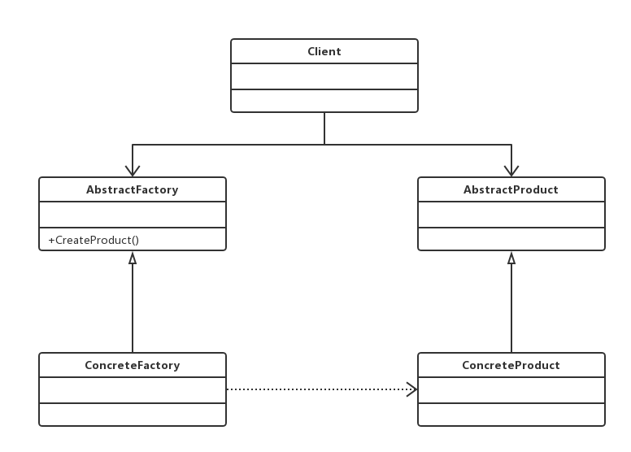

#抽象工厂模式
###为创建一组相关或相互依赖的对象提供一个接口，而且无须指定它们的具体类

##通用类图

抽象工厂模式是工厂方法模式的升级版本，在有多个业务品种、业务分类时，通过抽象
工厂模式产生需要的对象是一种非常好的解决方式。
###优点
- 封装性，每个产品的实现类不是高层模块要关心的，它要关心的是什么？是接口，是
抽象，它不关心对象是如何创建出来，这由谁负责呢？工厂类，只要知道工厂类是谁，我就
能创建出一个需要的对象，省时省力，优秀设计就应该如此。
 - 产品族内的约束为非公开状态。
###缺点
抽象工厂模式的最大缺点就是产品族扩展非常困难

