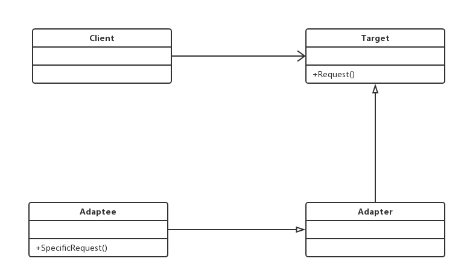

#适配器模式（Adapter Pattern）
###将一个类的接口变换成客户端所期待的另一种接口，从而使原本因接口不匹配而无法在一起工作的两个类能够在一起工作。

##通用类图

- Target目标角色
该角色定义把其他类转换为何种接口，也就是我们的期望接口，例子中的IUserInfo接口
就是目标角色。
- Adaptee源角色
你想把谁转换成目标角色，这个“谁”就是源角色，它是已经存在的、运行良好的类或对
象，经过适配器角色的包装，它会成为一个崭新、靓丽的角色。
- Adapter适配器角色
适配器模式的核心角色，其他两个角色都是已经存在的角色，而适配器角色是需要新建
立的，它的职责非常简单：把源角色转换为目标角色，怎么转换？通过继承或是类关联的方
式。

###优点
- 适配器模式可以让两个没有任何关系的类在一起运行，只要适配器这个角色能够搞定
他们就成。
- 增加了类的透明性
想想看，我们访问的Target目标角色，但是具体的实现都委托给了源角色，而这些对高
层次模块是透明的，也是它不需要关心的。
- 提高了类的复用度
当然了，源角色在原有的系统中还是可以正常使用，而在目标角色中也可以充当新的演
员。
- 灵活性非常好
###缺点

