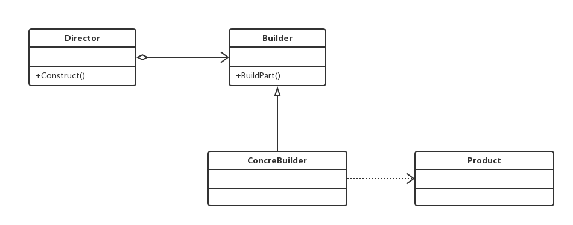
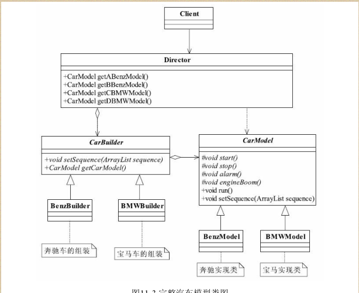

#建造者模式（Builder Pattern）也叫做生成器模式
###将一个复杂对象的构建与它的表示分离，使得同样的构建过程可以创建不同的表示

##通用类图

###在建造者模式中，有如下4个角色
- Product产品类通常是实现了模板方法模式，也就是有模板方法和基本方法
- Builder抽象建造者规范产品的组建，一般是由子类实现
- ConcreteBuilder具体建造者实现抽象类定义的所有方法，并且返回一个组建好的对象
- Director导演类负责安排已有模块的顺序，然后告诉Builder开始建造，

###建造者模式最主要的功能是基本方法的调用顺序安排，也就是这些基本方法已经实现了，通俗地说就是零件的装配，顺序不同产生的对象也不同；而工厂方法则重点是创建，创建零件是它的主要职责，组装顺序则不是它关心的。

###优点
- 封装性
- 建造者独立，容易扩展
- 便于控制细节风险
###缺点

##例子类图

