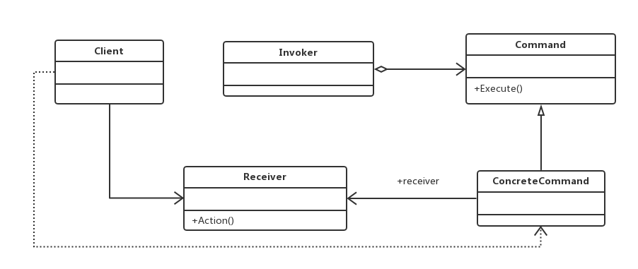

#命令模式
###将一个请求封装成一个对象，从而让你使用不同的请求把客户端参数化，对请求排队或者记录请求日志，可以提供命令的撤销和恢复功能。

##通用类图

- Receive接收者角色
    该角色就是干活的角色，命令传递到这里是应该被执行的
- Command命令角色
    需要执行的所有命令都在这里声明
- Invoker调用者角色
    接收到命令，并执行命令。

###优点
- 类间解耦
- 可扩展性

###缺点
命令模式也是有缺点的，请看Command的子类：如果有N个命令，问题就出来
了，Command的子类就可不是几个，而是N个，这个类膨胀得非常大，这个就需要读者在项
目中慎重考虑使用