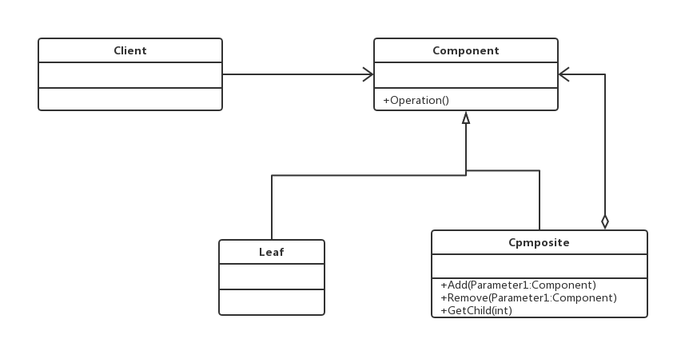
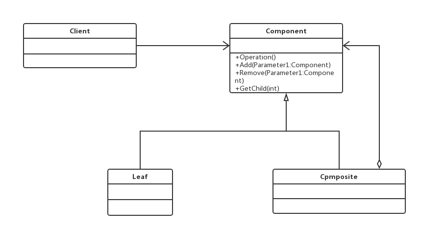

#组合模式(Composite Pattern)
###将对象组合成树形结构以表示“部分-整体”的层次结构，使得用户对单个对象和组合对象的使用具有一致性。

##通用类图

- Component抽象构件角色
定义参加组合对象的共有方法和属性，可以定义一些默认的行为或属性
- Leaf叶子构件
叶子对象，其下再也没有其他的分支，也就是遍历的最小单位。
- Composite树枝构件
树枝对象，它的作用是组合树枝节点和叶子节点形成一个树形结构。

###优点
- 高层模块调用简单
一棵树形机构中的所有节点都是Component，局部和整体对调用者来说没有任何区别，
也就是说，高层模块不必关心自己处理的是单个对象还是整个组合结构，简化了高层模块的
代码。
- 节点自由增加
使用了组合模式后，我们可以看看，如果想增加一个树枝节点、树叶节点是不是都很容
易，只要找到它的父节点就成，非常容易扩展，符合开闭原则，对以后的维护非常有利。
###缺点
组合模式有一个非常明显的缺点，看到我们在场景类中的定义，提到树叶和树枝使用时
的定义了吗？直接使用了实现类！这在面向接口编程上是很不恰当的，与依赖倒置原则冲
突，读者在使用的时候要考虑清楚，它限制了你接口的影响范围。

##透明模式的通用类图

