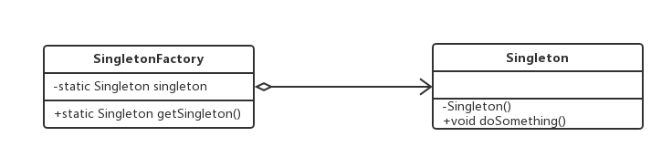
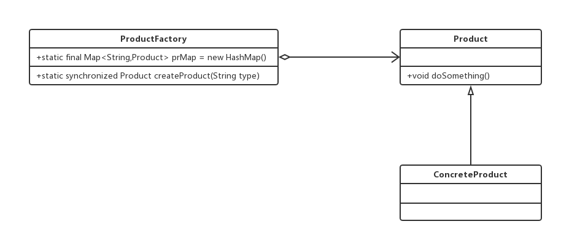

#工厂方法模式
###定义一个用于创建对象的接口，让子类决定实例化哪一个类。工厂方法使一个类的实例化延迟到其子类。

##通用类图

厂方法模式是new一个对象的替代品，所以在所有需要生成对象的地方都可以
使用，但是需要慎重地考虑是否要增加一个工厂类进行管理，增加代码的复杂度

##简单工厂模式类图(静态工厂模式)

##工厂方法模式替代单例模式

##延迟初始化
###一个对象被消费完毕后，并不立刻释放，工厂类保持其初始状态，等待再次被使用

延迟加载还可以用在对象初始化比较复杂的情况下，例如硬件访问，涉及多方面的交
互，则可以通过延迟加载降低对象的产生和销毁带来的复杂性