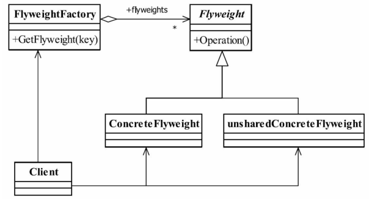

#享元模式（Flyweight Pattern）
###使用共享对象可有效地支持大量的细粒度的对象。

享元模式的定义为我们提出了两个要求：细粒度的对象和共享对象。我们知道分配太多
的对象到应用程序中将有损程序的性能，同时还容易造成内存溢出，那怎么避免呢？就是享
元模式提到的共享技术。我们先来了解一下对象的内部状态和外部状态。
要求细粒度对象，那么不可避免地使得对象数量多且性质相近，那我们就将这些对象的
信息分为两个部分：内部状态（intrinsic）与外部状态（extrinsic）。
- 内部状态
内部状态是对象可共享出来的信息，存储在享元对象内部并且不会随环境改变而改变，
如我们例子中的id、postAddress等，它们可以作为一个对象的动态附加信息，不必直接储存
在具体某个对象中，属于可以共享的部分。
- 外部状态
外部状态是对象得以依赖的一个标记，是随环境改变而改变的、不可以共享的状态
##通用类图

- Flyweight——抽象享元角色
它简单地说就是一个产品的抽象类，同时定义出对象的外部状态和内部状态的接口或实
现。
- ConcreteFlyweight——具体享元角色
具体的一个产品类，实现抽象角色定义的业务。该角色中需要注意的是内部状态处理应
该与环境无关，不应该出现一个操作改变了内部状态，同时修改了外部状态，这是绝对不允
许的。
- unsharedConcreteFlyweight——不可共享的享元角色
不存在外部状态或者安全要求（如线程安全）不能够使用共享技术的对象，该对象一般
不会出现在享元工厂中。
- FlyweightFactory——享元工厂
职责非常简单，就是构造一个池容器，同时提供从池中获得对象的方法。

###优点

###缺点

