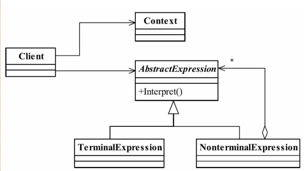

#解释器模式（Interpreter Pattern
###给定一门语言，定义它的文法的一种表示，并定义一个解释器，该解释器使用该表示来解释语言中的句子。

##通用类图

- AbstractExpression——抽象解释器
具体的解释任务由各个实现类完成，具体的解释器分别由TerminalExpression和Non-
terminalExpression完成。
- TerminalExpression——终结符表达式
实现与文法中的元素相关联的解释操作，通常一个解释器模式中只有一个终结符表达
式，但有多个实例，对应不同的终结符。具体到我们例子就是VarExpression类，表达式中的
每个终结符都在栈中产生了一个VarExpression对象。
- NonterminalExpression——非终结符表达式
文法中的每条规则对应于一个非终结表达式，具体到我们的例子就是加减法规则分别对
应到AddExpression和SubExpression两个类。非终结符表达式根据逻辑的复杂程度而增加，原
则上每个文法规则都对应一个非终结符表达式。
- Context——环境角色

###优点

###缺点

