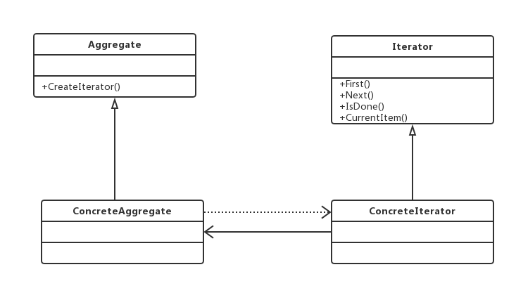

#迭代器模式（Iterator Pattern）
###它提供一种方法访问一个容器对象中各个元素，而又不需暴露该对象的内部细节。

##通用类图

- Iterator抽象迭代器
抽象迭代器负责定义访问和遍历元素的接口，而且基本上是有固定的3个方法：first()获
得第一个元素，next()访问下一个元素，isDone()是否已经访问到底部（Java叫做hasNext()方
法）。
- ConcreteIterator具体迭代器
具体迭代器角色要实现迭代器接口，完成容器元素的遍历。
- Aggregate抽象容器
容器角色负责提供创建具体迭代器角色的接口，必然提供一个类似createIterator()这样的
方法，在Java中一般是iterator()方法。
- Concrete Aggregate具体容器
具体容器实现容器接口定义的方法，创建出容纳迭代器的对象。

##做Java开发，尽量不要自己写迭代器模式！省省吧，使用Java提供的Iterator一般就能满足你的要求了

