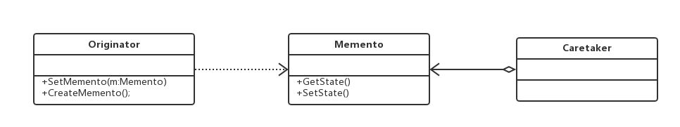
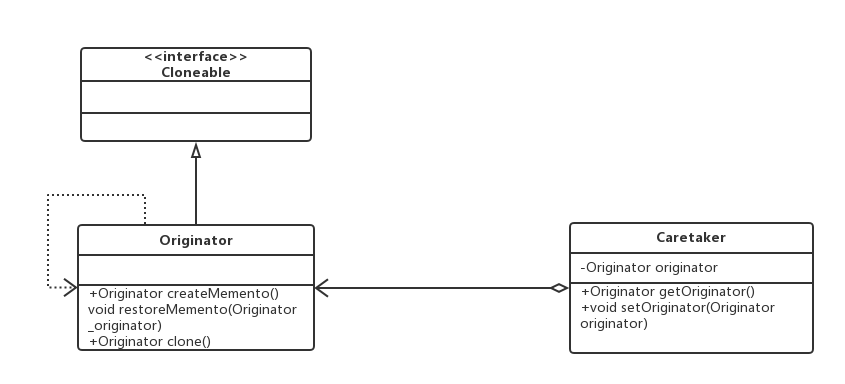

#备忘录模式（Memento Pattern）
###在不破坏封装性的前提下，捕获一个对象的内部状态，并在该对象之外保存这个状态。这样以后就可将该对象恢复到原先保存的状态。

##通用类图

- Originator发起人角色
记录当前时刻的内部状态，负责定义哪些属于备份范围的状态，负责创建和恢复备忘录
数据。
- Memento备忘录角色
负责存储Originator发起人对象的内部状态，在需要的时候提供发起人需要的内部状态。
- Caretaker备忘录管理员角色
对备忘录进行管理、保存和提供备忘录。

##Clone方式的备忘录

