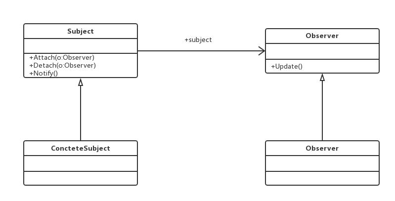

#观察者模式（Observer Pattern）
###定义对象间一种一对多的依赖关系，使得每当一个对象改变状态，则所有依赖于它的对象都会得到通知并被自动更新。

##通用类图

- Subject被观察者
定义被观察者必须实现的职责，它必须能够动态地增加、取消观察者。它一般是抽象类
或者是实现类，仅仅完成作为被观察者必须实现的职责：管理观察者并通知观察者。
- Observer观察者
观察者接收到消息后，即进行update（更新方法）操作，对接收到的信息进行处理。
- ConcreteSubject具体的被观察者
定义被观察者自己的业务逻辑，同时定义对哪些事件进行通知。
- ConcreteObserver具体的观察者
每个观察在接收到消息后的处理反应是不同，各个观察者有自己的处理逻辑。

###优点
- 观察者和被观察者之间是抽象耦合
如此设计，则不管是增加观察者还是被观察者都非常容易扩展，而且在Java中都已经实
现的抽象层级的定义，在系统扩展方面更是得心应手。
- 建立一套触发机制
###缺点
观察者模式需要考虑一下开发效率和运行效率问题，一个被观察者，多个观察者，开发
和调试就会比较复杂，而且在Java中消息的通知默认是顺序执行，一个观察者卡壳，会影响
整体的执行效率。在这种情况下，一般考虑采用异步的方式。
多级触发时的效率更是让人担忧，大家在设计时注意考虑。