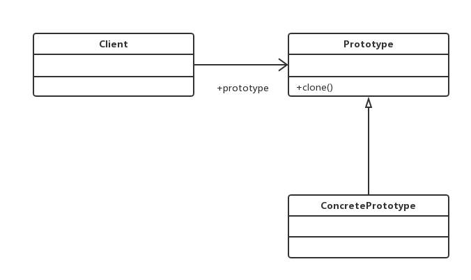

#原型模式（Prototype Pattern）
###用原型实例指定创建对象的种类，并且通过拷贝这些原型创建新的对象。
##通用类图

原型模式的核心是一个clone方法，通过该方法进行对象的拷贝

###优点
- 性能优良
    原型模式是在内存二进制流的拷贝，要比直接new一个对象性能好很多，特别是要在一
    个循环体内产生大量的对象时，原型模式可以更好地体现其优点。
- 逃避构造函数的约束

