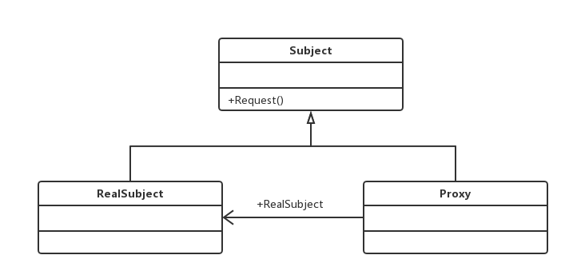
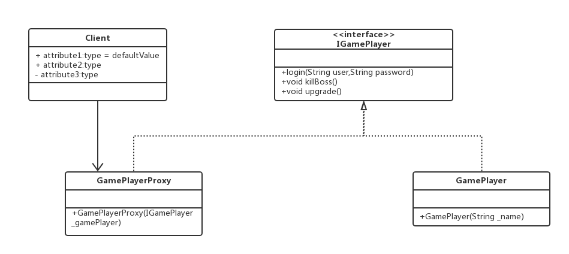

#代理模式（Proxy Pattern）
###为其他对象提供一种代理以控制对这个对象的访问
##通用类图

代理模式也叫做委托模式，它是一项基本设计技巧。
####三个角色的定义：
- Subject抽象主题角色
#####抽象主题类可以是抽象类也可以是接口，是一个最普通的业务类型定义，无特殊要求。
- RealSubject具体主题角色
#####也叫做被委托角色、被代理角色。它才是冤大头，是业务逻辑的具体执行者。
- Proxy代理主题角色
#####也叫做委托类、代理类。它负责对真实角色的应用，把所有抽象主题类定义的方法限制委托给真实主题角色实现，并且在真实主题角色处理完毕前后做预处理和善后处理工作。

##Demo

###优点
- 职责清晰
- 高扩展性
- 智能化
###缺点

