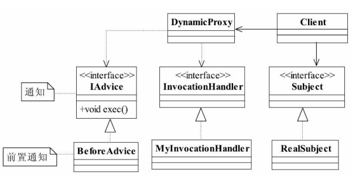
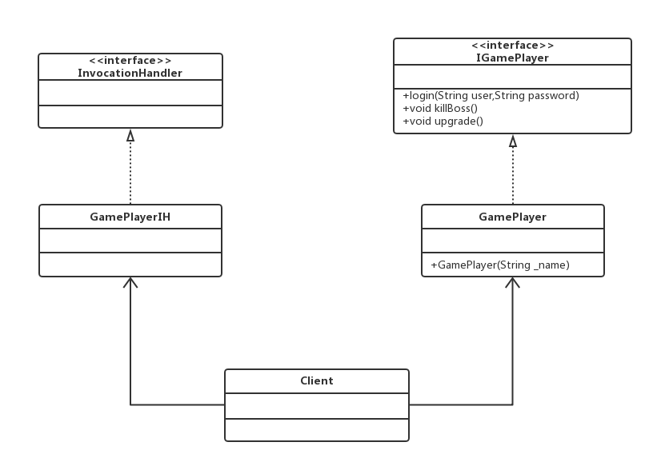

#代理模式（Proxy Pattern）
###为其他对象提供一种代理以控制对这个对象的访问
##通用类图

代理模式也叫做委托模式，它是一项基本设计技巧。
####三个角色的定义：
- Subject抽象主题角色
#####抽象主题类可以是抽象类也可以是接口，是一个最普通的业务类型定义，无特殊要求。
- RealSubject具体主题角色
#####也叫做被委托角色、被代理角色。它才是冤大头，是业务逻辑的具体执行者。
- Proxy代理主题角色
#####也叫做委托类、代理类。它负责对真实角色的应用，把所有抽象主题类定义的方法限制委托给真实主题角色实现，并且在真实主题角色处理完毕前后做预处理和善后处理工作。

##Demo

###优点
- 职责清晰
- 高扩展性
- 智能化

###普通代理 
在该模式下，调用者只知代理而不用知道真实的角色是谁，屏蔽了
真实角色的变更对高层模块的影响，真实的主题角色想怎么修改就怎么修改，对高层次的模
块没有任何的影响，只要你实现了接口所对应的方法，该模式非常适合对扩展性要求较高的
场合

###强制代理 
强制代理的概念就是要从真实角色查找到代理角色，不允
许直接访问真实角色

##动态代理
###动态代理是在实现阶段不用关心代理谁，而在运行阶段才指定代理哪一个对象。
##动态代理通用类图

###Demo

在类图中增加了一个InvocationHandler接口和GamePlayIH类，作用就是产生一个对象的
代理对象，其中InvocationHandler是JDK提供的动态代理接口，对被代理类的方法进行代理。

