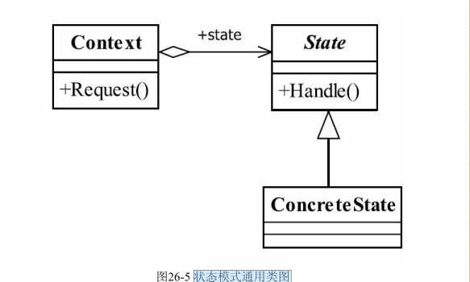

#状态模式
###当一个对象内在状态改变时允许其改变行为，这个对象看起来像改变了其类

##通用类图

- State——抽象状态角色
接口或抽象类，负责对象状态定义，并且封装环境角色以实现状态切换。
- ConcreteState——具体状态角色
每一个具体状态必须完成两个职责：本状态的行为管理以及趋向状态处理，通俗地说，
就是本状态下要做的事情，以及本状态如何过渡到其他状态。
- Context——环境角色
定义客户端需要的接口，并且负责具体状态的切换。

###优点
- 结构清晰
避免了过多的switch...case或者if...else语句的使用，避免了程序的复杂性,提高系统的可
维护性。
- 遵循设计原则
很好地体现了开闭原则和单一职责原则，每个状态都是一个子类，你要增加状态就要增
加子类，你要修改状态，你只修改一个子类就可以了。
- 封装性非常好
这也是状态模式的基本要求，状态变换放置到类的内部来实现，外部的调用不用知道类
内部如何实现状态和行为的变换。

###缺点
状态模式既然有优点，那当然有缺点了。但只有一个缺点，子类会太多，也就是类膨
胀。如果一个事物有很多个状态也不稀奇，如果完全使用状态模式就会有太多的子类，不好
管理，
