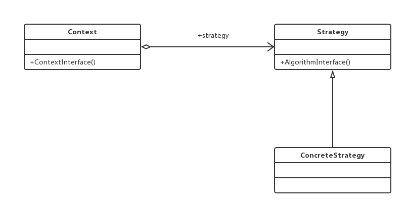

#策略模式（Strategy Pattern）
###定义一组算法，将每个算法都封装起来，并且使它们之间可以互换。
##通用类图

策略模式使用的就是面向对象的继承和多态机制，非常容易理解和掌握，我们再来看看
策略模式的三个角色：
- Context封装角色
它也叫做上下文角色，起承上启下封装作用，屏蔽高层模块对策略、算法的直接访问，
封装可能存在的变化。
- Strategy抽象策略角色
策略、算法家族的抽象，通常为接口，定义每个策略或算法必须具有的方法和属性。各
位看官可能要问了，类图中的AlgorithmInterface是什么意思，嘿嘿，algorithm是“运算法则”的
意思，结合起来意思就明白了吧。
- ConcreteStrategy具体策略角色
实现抽象策略中的操作，该类含有具体的算法。

###优点
- 算法可以自由切换
这是策略模式本身定义的，只要实现抽象策略，它就成为策略家族的一个成员，通过封
装角色对其进行封装，保证对外提供“可自由切换”的策略。
- 避免使用多重条件判断
如果没有策略模式，我们想想看会是什么样子？一个策略家族有5个策略算法，一会要
使用A策略，一会要使用B策略，怎么设计呢？使用多重的条件语句？多重条件语句不易维
护，而且出错的概率大大增强。使用策略模式后，可以由其他模块决定采用何种策略，策略
家族对外提供的访问接口就是封装类，简化了操作，同时避免了条件语句判断。
- 扩展性良好
这甚至都不用说是它的优点，因为它太明显了。在现有的系统中增加一个策略太容易
了，只要实现接口就可以了，其他都不用修改，类似于一个可反复拆卸的插件，这大大地符
合了OCP原则。
###缺点
- 策略类数量增多
每一个策略都是一个类，复用的可能性很小，类数量增多。
- 所有的策略类都需要对外暴露