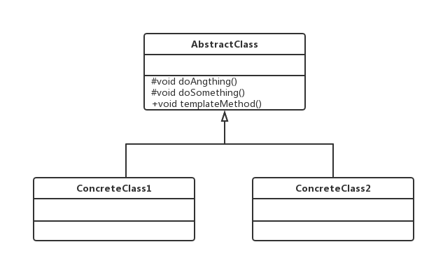

#模板方法模式（Template Method Pattern）
###定义一个操作中的算法的框架，而将一些步骤延迟到子类中。使得子类可以不改变一个算法的结构即可重定义该算法的某些特定步骤
##通用类图

AbstractClass叫做抽象模板，它的方法分为两类：
- 基本方法
基本方法也叫做基本操作，是由子类实现的方法，并且在模板方法被调用。
- 模板方法
可以有一个或几个，一般是一个具体方法，也就是一个框架，实现对基本方法的调度，完成固定的逻辑。
####为了防止恶意的操作，一般模板方法都加上final关键字，不允许被覆写。
####抽象模板中的基本方法尽量设计为protected类型，符合迪米特法则，不需要暴露的属性或方法尽量不要设置为protected类型。实现类若非必要，尽量不要扩大父类中的访问权限。

###优点
- 封装不变部分，扩展可变部分
- 提取公共部分代码，便于维护
- 行为由父类控制，子类实现
###缺点

