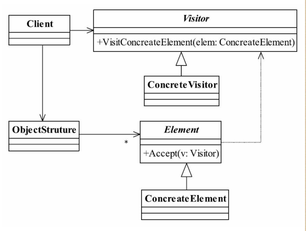

#访问者模式（Visitor Pattern）
###封装一些作用于某种数据结构中的各元素的操作，它可以在不改变数据结构的前提下定义作用于这些元素的新的操作。

##通用类图

- Visitor——抽象访问者
抽象类或者接口，声明访问者可以访问哪些元素，具体到程序中就是visit方法的参数定
义哪些对象是可以被访问的。
- ConcreteVisitor——具体访问者
它影响访问者访问到一个类后该怎么干，要做什么事情。
- Element——抽象元素
接口或者抽象类，声明接受哪一类访问者访问，程序上是通过accept方法中的参数来定
义的。
- ConcreteElement——具体元素
实现accept方法，通常是visitor.visit(this)，基本上都形成了一种模式了。
- ObjectStruture——结构对象
元素产生者，一般容纳在多个不同类、不同接口的容器，如List、Set、Map等，在项目
中，一般很少抽象出这个角色。

###优点
- 符合单一职责原则
具体元素角色也就是Employee抽象类的两个子类负责数据的加载，而Visitor类则负责报
表的展现，两个不同的职责非常明确地分离开来，各自演绎变化。
- 优秀的扩展性
由于职责分开，继续增加对数据的操作是非常快捷的，例如，现在要增加一份给大老板
的报表，这份报表格式又有所不同，直接在Visitor中增加一个方法，传递数据后进行整理打
印。
- 灵活性非常高
###缺点
- 具体元素对访问者公布细节
访问者要访问一个类就必然要求这个类公布一些方法和数据，也就是说访问者关注了其
他类的内部细节，这是迪米特法则所不建议的。
- 具体元素变更比较困难
具体元素角色的增加、删除、修改都是比较困难的，就上面那个例子，你想想，你要是
想增加一个成员变量，如年龄age，Visitor就需要修改，如果Visitor是一个还好办，多个呢？
业务逻辑再复杂点呢？
- 违背了依赖倒置转原则
访问者依赖的是具体元素，而不是抽象元素，这破坏了依赖倒置原则，特别是在面向对
象的编程中，抛弃了对接口的依赖，而直接依赖实现类，扩展比较难。

