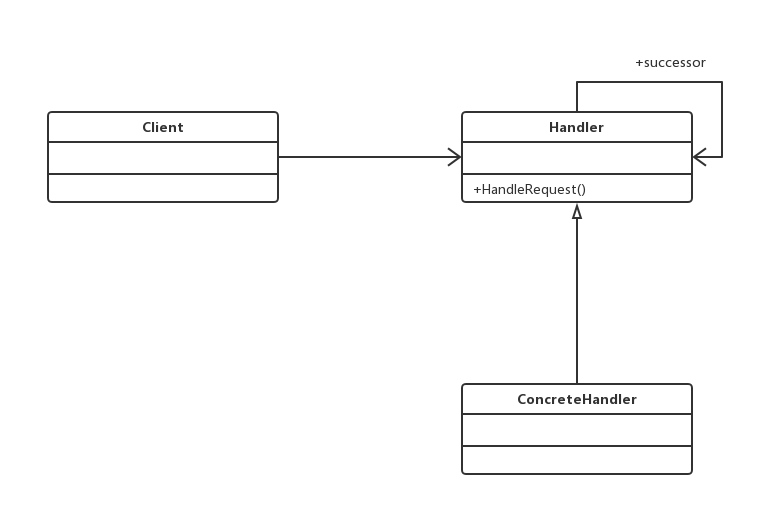

#README.md
###使多个对象都有机会处理请求，从而避免了请求的发送者和接受者之间的耦合关系。将这些对象连成一条链，并沿着这条链传递该请求，直到有对象处理它为止。

##通用类图

责任链模式的核心在“链”上，“链”是由多个处理者ConcreteHandler组成的

###优点
责任链模式非常显著的优点是将请求和处理分开。请求者可以不用知道是谁处理的，处
理者可以不用知道请求的全貌，两者解耦，提高系统的灵活性。
###缺点
责任链有两个非常显著的缺点：一是性能问题，每个请求都是从链头遍历到链尾，特别
是在链比较长的时候，性能是一个非常大的问题。二是调试不很方便，特别是链条比较长，
环节比较多的时候，由于采用了类似递归的方式，调试的时候逻辑可能比较复杂。

